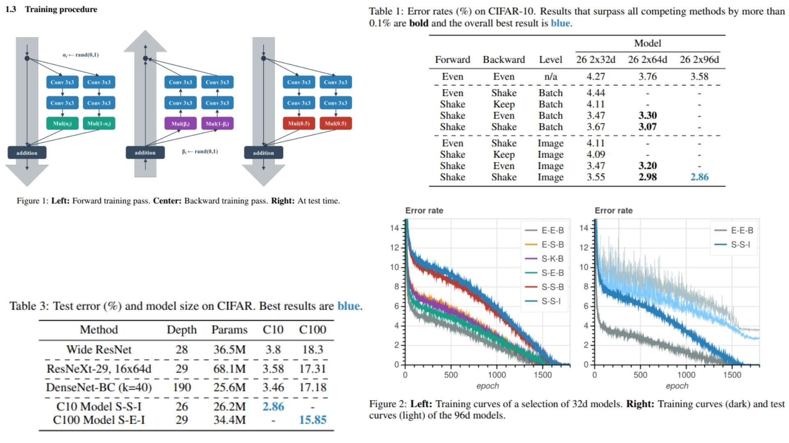
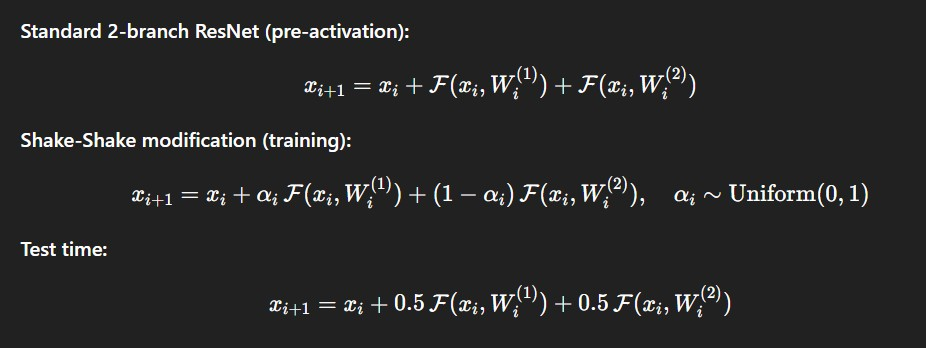

# 🌠 Shake-Shake PyTorch Implementation

This repository contains a PyTorch implementation of **Shake-Shake Regularization**, a stochastic regularization method for **3-branch residual networks**. The goal is to improve generalization by **randomly mixing two residual branches** during training.

- Shake-Shake applied **within residual blocks** of the network.  
- Random α coefficients combine branch outputs during forward and backward passes.  
- Architecture:  
**Input → Backbone with Shake-Shake → Avg Pool → Flatten → FC → Output**  

**Paper reference:** [Shake-Shake Regularization](https://arxiv.org/abs/1705.07485) 🐰


> 💡 If you are interested in advanced regularization techniques, check out **[ShakeDrop-Replication]([https://github.com/your-link/ShakeDrop-Replication](https://github.com/barkinadiguzel/ShakeDrop-Replication))** for another interesting approach!
---

## 🖼 Overview – Shake-Shake Architecture

  

This overview summarizes the Shake-Shake network pipeline:

- **Input:** Original image enters the network.  
- **Backbone:** Feature maps are extracted using a ResNet-like backbone with Shake-Shake in residual blocks.  
- **Residual Mixing:** Two residual branches are combined with a random α coefficient per block.  
- **Pooling & FC:** Features are pooled, flattened, and fed into a fully connected layer for final classification.  

The model improves robustness by preventing over-reliance on any single residual branch.

---

## 🧮 Key Mathematical Idea

  

Let $$x_i$$ be the input tensor to residual block $$i$$. Two residual branches with weights $$W_i^{(1)}$$ and $$W_i^{(2)}$$ produce:

$$
x_{i+1} = x_i + F(x_i, W_i^{(1)}) + F(x_i, W_i^{(2)})
$$

With Shake-Shake, a random variable $$\alpha_i \sim U(0,1)$$ mixes the branches during training:

$$
x_{i+1} = x_i + \alpha_i F(x_i, W_i^{(1)}) + (1-\alpha_i) F(x_i, W_i^{(2)})
$$

At test time, all $$\alpha_i$$ are set to the expected value 0.5.

---

## 🏗️ Model Architecture

```bash
ShakeShake-Replication/
│
├── src/
│   ├── layers/
│   │   ├── conv_block.py
│   │   ├── shake_layer.py
│   │   ├── residual_block.py
│   │   ├── downsample_block.py
│   │   └── pool_fc_block.py
│   │
│   ├── modules/
│   │   └── backbone_resnet.py
│   │
│   ├── model/
│   │   └── shake_resnet.py
│   │
│   └── config.py
│
├── images/
│   ├── figmix.jpg    
│   └── math.jpg       
│
├── requirements.txt
└── README.md
```
---


## 🔗 Feedback

For questions or feedback, contact: [barkin.adiguzel@gmail.com](mailto:barkin.adiguzel@gmail.com)
